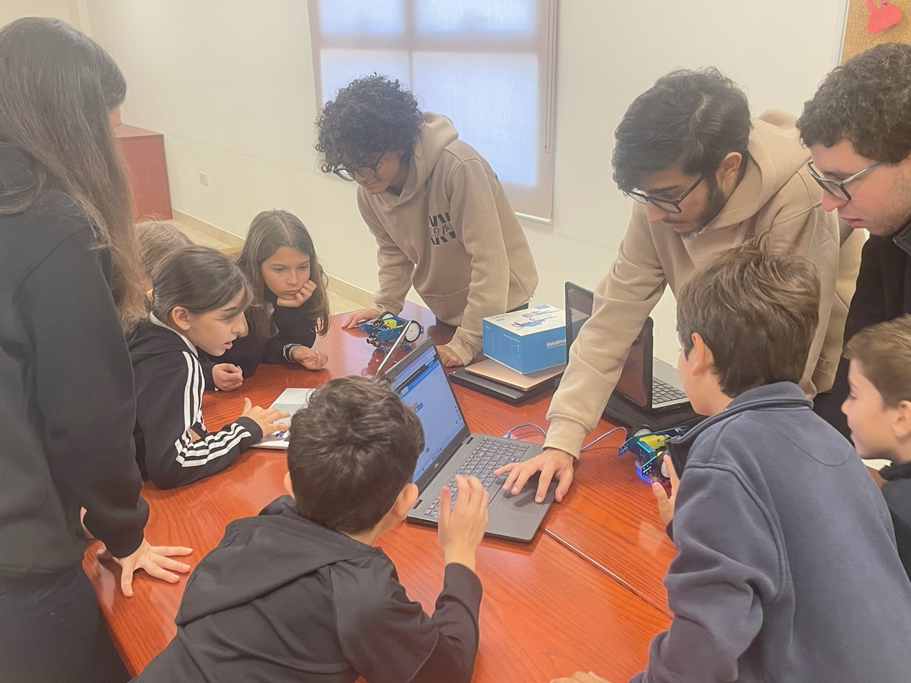
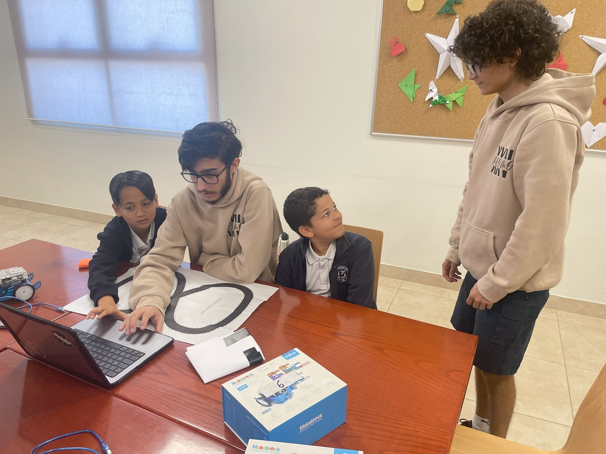
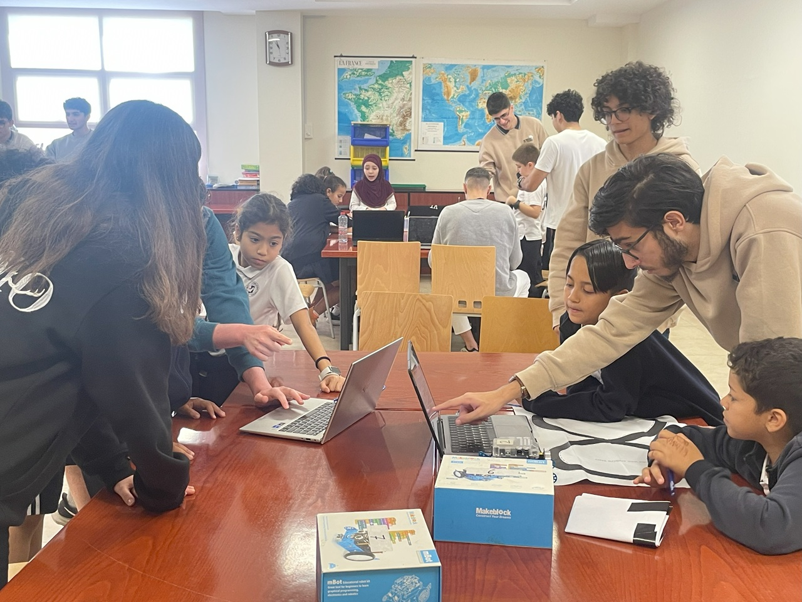

# Portfolio

Voici mon porfolio ou vous pourrez retrouver:  
- Un site pouvant servir en CV
- Quelque oeuvre artistique auquel j'ai participé
- Des projets que j'ai pu mener a bien a l'aide d'ancien camarade de classe du lycée
- Un début de projet de jeu vidéo

## Site web 

En cliquant sur le lien ci-dessous vous pourrez voir mon site sevrant aussi de CV dans lequel vous retrouverez des information générale  

[Le site en question](https://brad1507.github.io/)

Le corp du site a été fait par mon ancien professeur de NSI et j'ai écris les information présent dedans, tout en réutilisant et comprenant les fonctions java présent dans le code

## Projet artisitque : Court métrage

Voici deux projeys auquele j'ai participier sous differentes facon 

Le premier dans lequel j'étais acteur a ce lien :  https://www.youtube.com/watch?v=gkwSmC-PUxA&t=4s

Et ce second court métrage dans lequel j'ai pu avoir plusieur role :  https://www.youtube.com/watch?v=sbhUF9MLC4k&t=1s

## Projet Scolaire

Vous pouvez retrouvez ci-dessous quelque photo d'un projet ayant pour but d'apprender sous forme de leçon ludo-éducatif a programmer un robot avec mBlock

Des vidéo seront disponible dans le dossier portfolio(*mais ils étais trop gros pour que je puisse les afficher sdans ce readMe*)
